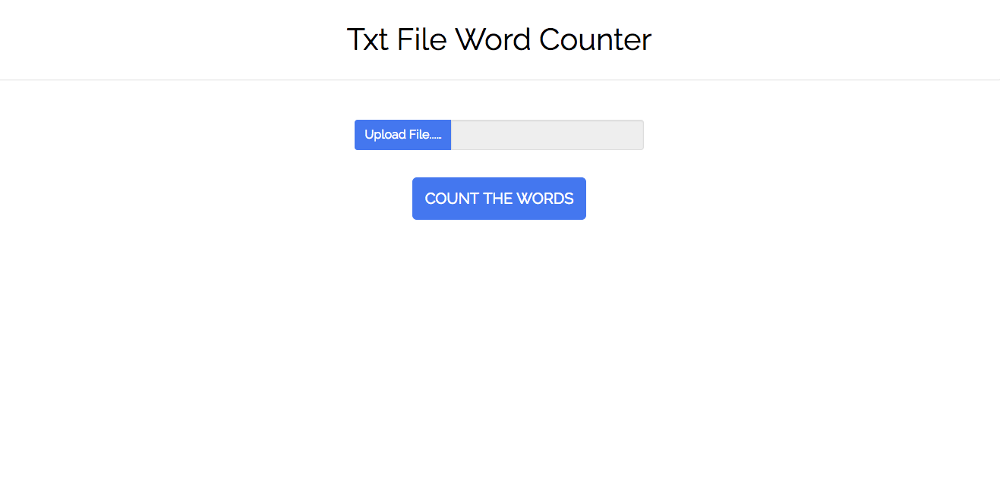
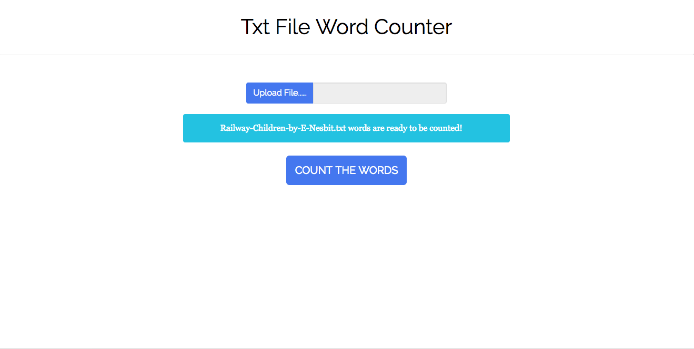
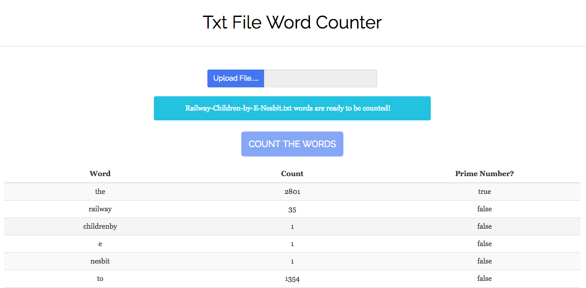

# WordCounter

An Angular web app to count the words in a chosen .txt file. It will also highlight the number counts that are prime numbers.

Main Functionality:
-----
* User can upload a .txt file
* User will see a successful message if input file can be read
* User will see a error message if input is not a .txt file
* User can click 'Count the Words' button to load a table with the words and their totals
* User will see a table with the totals and also whether the number is prime or not

Struggles / Improvements to be Made:
-----
* Look into and speed up the count and table load functionality
* Better unit testing - setback by struggle with mocking and injecting the FileHandlerService to test the file uploader
* Improve the way that the text string is split, as some words were put together (I think due to the the trim method)
* Extract the prime number checker function into a helper file so that it isn't in the homepage component
* Extract the word counter table into it's on component (currently in the homepage component)
* Sort the table data by highest to lowest
* Would like to highlight the background colour of the count number in the table if the number is prime,
 rather than having another column.
* Show data in a different form e.g. different sized circles with the word and count in them to improve the visuals.

How to Install:
-----
* Clone this repo https://github.com/louisaspicer/word-counter
* In your terminal, `cd word-counter`
* Run `ng serve` for a dev server. Navigate to `http://localhost:4200/`.

## Running unit tests

Run `ng test` to execute the unit tests via [Karma](https://karma-runner.github.io).

## Running end-to-end tests

Run `ng e2e` to execute the end-to-end tests via [Protractor](http://www.protractortest.org/).

Screenshots:
-----
##### Before Upload:

##### After Upload:

##### After Count Button Click:

